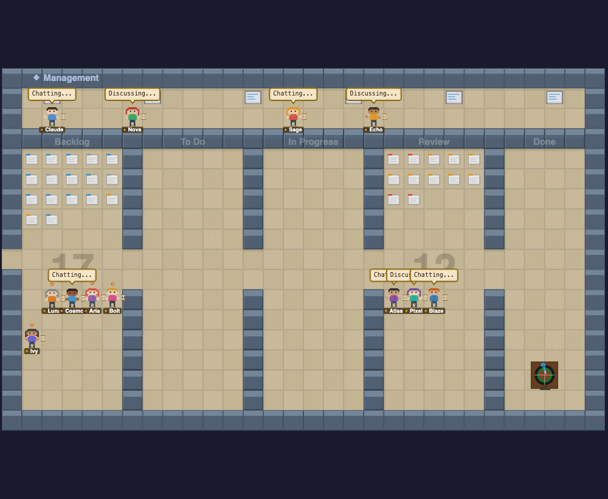
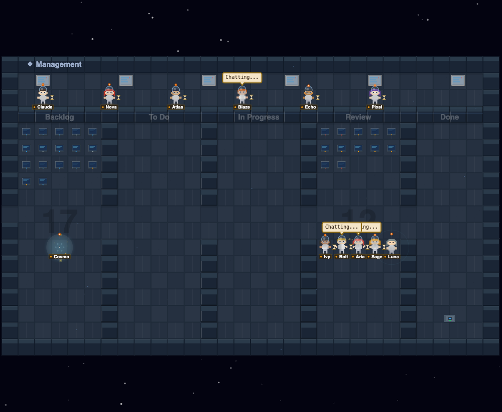
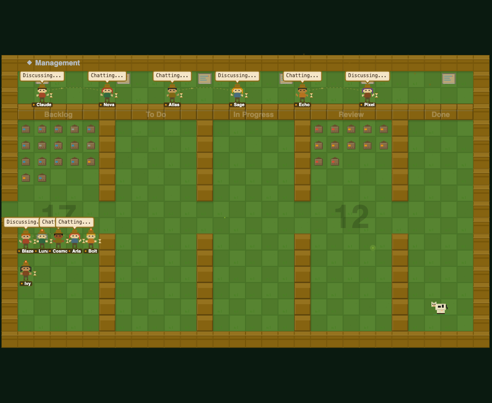
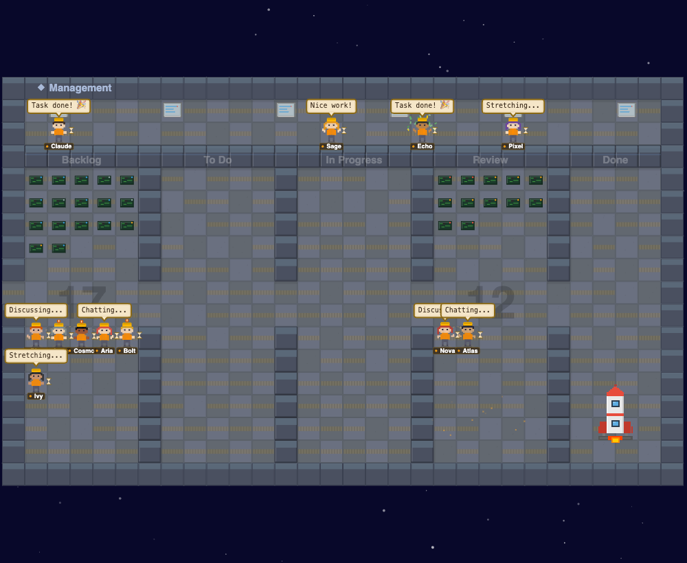
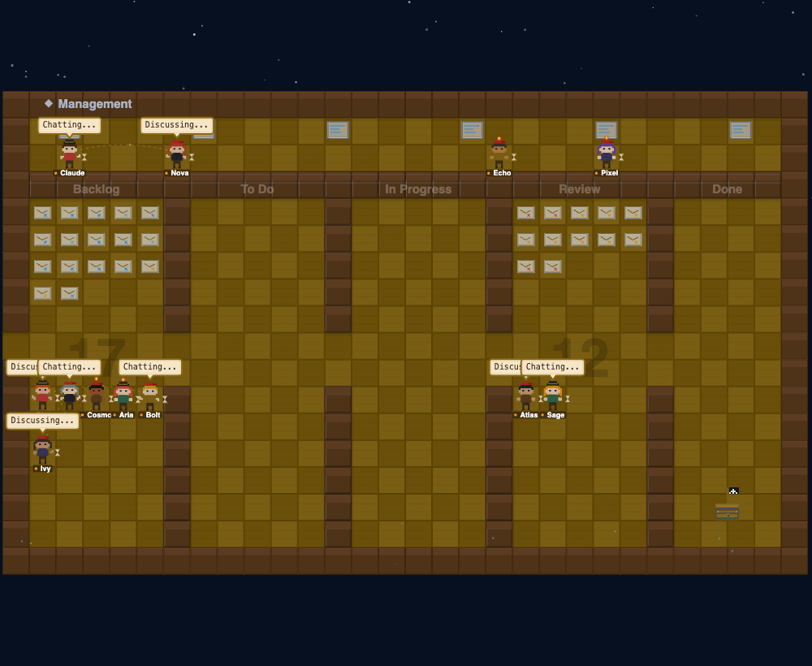
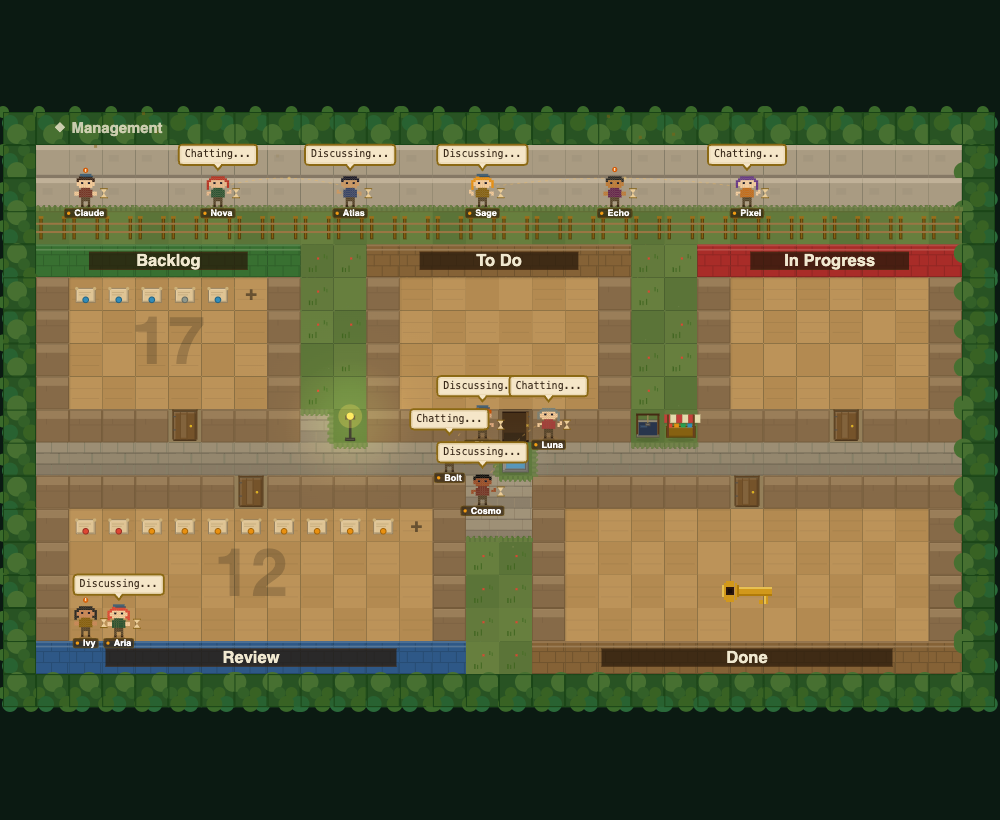
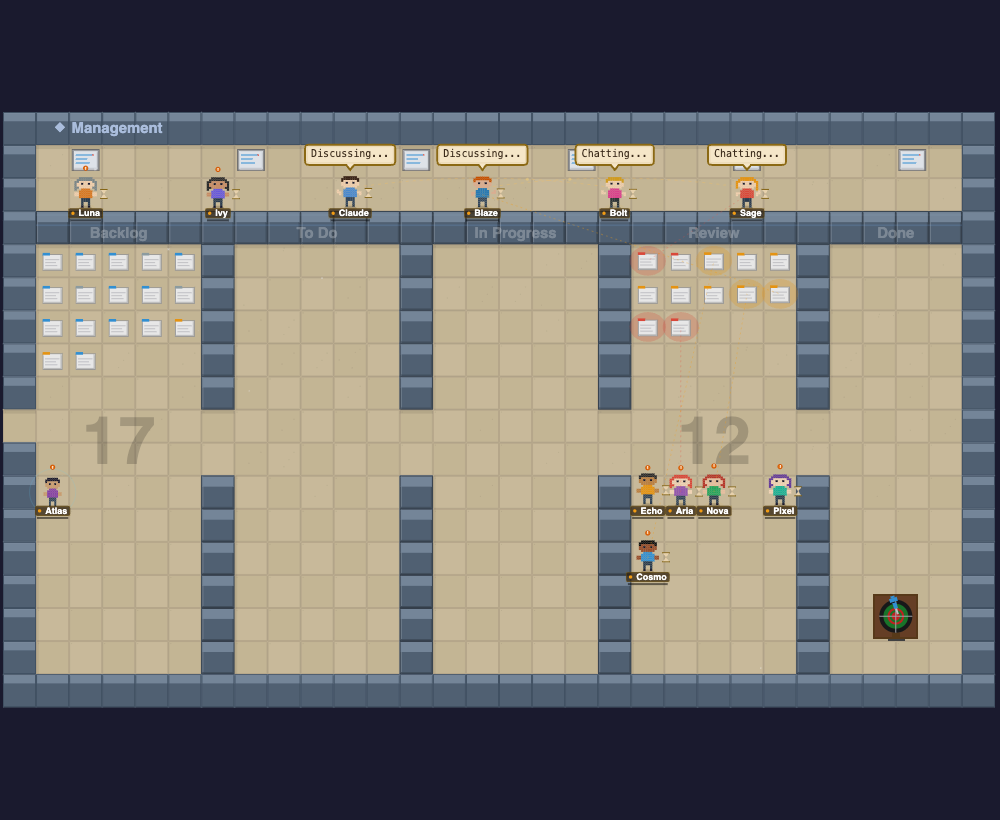

# Agent Town

A framework-agnostic TypeScript library that renders pixel-art scenes of AI agents working in themed environments. Uses HTML5 Canvas 2D with procedural rendering — no sprite sheets, no runtime dependencies.

Each agent you register gets its own animated pixel character that walks around, sits down, and visually reflects what it's doing: typing when writing code, reading when scanning files, thinking when processing, waiting when it needs input.

> **[Try the Live Playground →](https://agent-town.vercel.app/playground)**



## Features

- **Zero dependencies** — pure TypeScript, renders to a single `<canvas>`
- **Framework-agnostic** — works with vanilla JS, React, Vue, Svelte, or anything with a DOM
- **7 themed environments** — Office, Rocket Launch, Space Station, Farm & Ranch, Hospital, Pirate Ship, Town
- **3 grid sizes** — Small (20×13, up to 8 agents), Medium (26×16, up to 16), Large (34×20, up to 24)
- **Kanban task visualization** — tasks render as pixel-art items inside stage rooms; overflow indicators and background watermark counts per stage
- **Done stage effects** — completed tasks appear faded with green checkmarks; completion bag (big object) grows with progress
- **Flying task animations** — tasks animate between rooms when moving across kanban stages
- **30+ activity zones** — agents are assigned to zones and move between them based on status
- **Multi-room layouts** — internal walls with doorways, BFS pathfinding through rooms
- **Animated elements** — warp-speed viewscreen, farm animals, tractor with spinning wheels, particle effects
- **Pixel art characters** — 10 diverse, procedurally-colored character palettes
- **Live activity tracking** — characters animate based on status: `typing`, `reading`, `thinking`, `waiting`, `success`, `error`
- **Speech bubbles** — show what each agent is working on
- **Auto-scaling** — fits any container size, pixel-perfect at integer zoom with `imageSmoothingEnabled = false`
- **Responsive** — handles resize automatically via `ResizeObserver`
- **Clickable agents** — click a character to identify it

## Environments

7 themed environments — each with unique pixel-art tiles, furniture, and animated elements:

| Environment | Description | Key Features |
|---|---|---|
| **Office** | Classic workspace | Desks, meeting rooms, water cooler, whiteboard. 3 themes: casual / business / hybrid |
| **Rocket Launch** | Launch site | Rocket on right side, control panels, tool benches, fuel tanks |
| **Space Station** | Orbital lab | Animated warp-speed viewscreen, consoles, airlocks, lab equipment |
| **Farm & Ranch** | Rural workspace | Animated cow/chicken/sheep, tractor with spinning wheels & exhaust, barn, crops |
| **Hospital** | Research lab | Pharmaceutical/research themed — lab benches, equipment, reception |
| **Pirate Ship** | Seafaring vessel | Captain's quarters, cannons, barrels, map table, crow's nest |
| **Town** | RPG village | Outdoor buildings with peaked roofs, cobblestone roads, streetlamps, trees, fences |

<table>
<tr>
<td><strong>Space Station</strong><br></td>
<td><strong>Farm & Ranch</strong><br></td>
</tr>
<tr>
<td><strong>Rocket Launch</strong><br></td>
<td><strong>Pirate Ship</strong><br></td>
</tr>
<tr>
<td><strong>Town</strong><br></td>
<td><strong>Office</strong><br></td>
</tr>
</table>

## Install

```bash
npm install agent-town
```

Or use a CDN:

```html
<script src="https://unpkg.com/agent-town/dist/agent-town.umd.cjs"></script>
```

## Quick Start

```html
<div id="town" style="width: 100%; height: 500px;"></div>

<script type="module">
  import { AgentTown } from 'agent-town';

  const town = new AgentTown({
    container: document.getElementById('town'),
    environment: 'space_station',  // any of the 6 environments
    officeSize: 'medium',          // 'small' | 'medium' | 'large'
  });

  // Add an agent — it walks to an available zone automatically
  town.addAgent({ id: 'claude', name: 'Claude' });

  // Update what the agent is doing
  town.updateAgent('claude', {
    status: 'typing',
    message: 'Writing auth module...',
  });

  // Later, mark it done
  town.updateAgent('claude', {
    status: 'success',
    message: 'Build passed!',
  });
</script>
```

## API

### `new AgentTown(config)`

Creates the visualization and starts rendering.

| Option | Type | Default | Description |
|--------|------|---------|-------------|
| `container` | `HTMLElement` | *required* | DOM element to render into |
| `environment` | `EnvironmentId` | `'office'` | One of: `office`, `rocket`, `space_station`, `farm`, `hospital`, `pirate_ship`, `town` |
| `officeSize` | `OfficeSize` | `'medium'` | Grid size: `small` (20×13), `medium` (26×16), `large` (34×20) |
| `theme` | `ThemeId` | `'casual'` | Office theme: `casual`, `business`, `hybrid` |
| `scale` | `number` | auto | Pixel zoom level (auto-calculated from container size) |
| `autoSize` | `boolean` | `true` | Auto-resize canvas to fill container |
| `onAgentClick` | `(id: string) => void` | — | Callback when a character is clicked |

### `town.addAgent(config)`

Spawns a new agent character. It walks to the next available activity zone.

```typescript
town.addAgent({
  id: 'agent-1',       // unique identifier
  name: 'Claude',      // display name
  status: 'typing',    // optional initial status
  message: 'Starting…', // optional speech bubble
  role: 'Engineer',    // optional role label
  team: 'Backend',     // optional team label
});
```

### `town.updateAgent(id, update)`

Updates an agent's status and/or message.

```typescript
town.updateAgent('agent-1', {
  status: 'reading',
  message: 'Scanning codebase…',  // null to clear
});
```

**Available statuses:**

| Status | Animation | Icon |
|--------|-----------|------|
| `idle` | Standing still | Gray dot |
| `typing` | Arms moving | Blue dot |
| `reading` | Arms down, focused | Purple dot |
| `thinking` | Standing still | Animated dots |
| `waiting` | Standing still | Pulsing `!` |
| `success` | Standing still | Green checkmark |
| `error` | Standing still | Red X |

### `town.removeAgent(id)` / `town.removeAllAgents()`

Removes agent(s) and frees their activity zones.

### `town.getAgent(id)` / `town.getAgents()`

Retrieve agent instances for inspection.

### Environment & Theme

```typescript
town.setEnvironment('farm');      // switch environment (resets layout)
town.setOfficeSize('large');      // change grid size
town.setTheme('business');        // change office color theme
town.setRoomMode('kanban');       // 'kanban' (tasks in rooms) or 'free'
```

### Activity Log

```typescript
town.logActivity('agent-1', 'status_change', 'Started coding');
town.getActivityLog();   // returns ActivityEvent[]
town.clearActivityLog();
```

### Task Management

```typescript
town.addTask({ id: 't1', title: 'Fix bug', description: '...', stage: 'todo', priority: 'high' });
town.updateTask('t1', { stage: 'in_progress', assigneeId: 'agent-1' });
town.getTasks();                    // all tasks
town.getTasksByStage('in_progress'); // filtered
town.clearTasks();
```

### Code Reviews

```typescript
town.addReview({ id: 'r1', agentId: 'agent-1', agentName: 'Claude', title: 'PR #42', description: '...', type: 'approval' });
town.resolveReview('r1', 'approved');
town.getReviews();        // all reviews
town.getPendingReviews(); // unresolved only
town.clearReviews();
```

### Events

```typescript
town.on('agentAdded', (id) => console.log(`${id} joined`));
town.on('agentClick', (id) => console.log(`clicked ${id}`));
town.on('agentRemoved', (id) => console.log(`${id} left`));
town.on('activity', (event) => console.log(event));
town.on('taskUpdated', (task) => console.log(task));
town.on('reviewAdded', (review) => console.log(review));
town.on('themeChanged', (theme) => console.log(theme));
town.on('ready', () => console.log('town ready'));
```

### `town.destroy()`

Stops rendering, removes the canvas, and cleans up all listeners.

## Integration Examples

### With WebSocket

```javascript
const ws = new WebSocket('ws://localhost:8080/agents');

ws.onmessage = (event) => {
  const { type, id, name, status, message } = JSON.parse(event.data);

  switch (type) {
    case 'spawn':  town.addAgent({ id, name }); break;
    case 'update': town.updateAgent(id, { status, message }); break;
    case 'remove': town.removeAgent(id); break;
  }
};
```

### With React

```tsx
import { useEffect, useRef } from 'react';
import { AgentTown } from 'agent-town';

function AgentScene({ agents, environment = 'office' }) {
  const ref = useRef<HTMLDivElement>(null);
  const townRef = useRef<AgentTown>();

  useEffect(() => {
    townRef.current = new AgentTown({
      container: ref.current!,
      environment,
    });
    return () => townRef.current?.destroy();
  }, [environment]);

  useEffect(() => {
    const town = townRef.current;
    if (!town) return;

    const current = new Set(town.getAgents().map(a => a.id));
    for (const a of agents) {
      if (!current.has(a.id)) town.addAgent(a);
      else town.updateAgent(a.id, a);
    }
  }, [agents]);

  return <div ref={ref} style={{ width: '100%', height: 500 }} />;
}
```

### With Server-Sent Events

```javascript
const events = new EventSource('/api/agent-stream');

events.onmessage = (e) => {
  const { action, ...data } = JSON.parse(e.data);
  if (action === 'add') town.addAgent(data);
  if (action === 'update') town.updateAgent(data.id, data);
  if (action === 'remove') town.removeAgent(data.id);
};
```

## Development

```bash
git clone https://github.com/rafapetter/agent-town.git
cd agent-town
npm install
npm run dev
```

Open `http://localhost:3000` to see the playground — a Next.js app with workspace presets (Startup, Agency, Enterprise), agent management, kanban views, code review approval flow, analytics, and a chat panel. The playground uses the `AgentSimulation` engine to drive realistic multi-agent workflows.

### Build

```bash
npm run build
```

Outputs to `dist/`:
- `agent-town.js` — ES module
- `agent-town.umd.cjs` — UMD (for `<script>` tags)
- `index.d.ts` — TypeScript declarations

### Release

```bash
npm version patch  # or minor / major
git push origin main --tags
# GitHub Actions auto-publishes to npm on v* tags
```

## Architecture

```
src/                          Library (published to npm)
├── index.ts                  Public exports
├── AgentTown.ts              API facade — the only class users interact with
├── engine.ts                 requestAnimationFrame game loop
├── renderer.ts               Canvas 2D rendering (tiles, furniture, characters, UI, animations)
├── world.ts                  Grid, environment layouts, BFS pathfinding, activity zones
├── themes.ts                 Color palettes and grid dimensions per theme/size
├── sprites.ts                Pixel art character templates and palette system
├── agent.ts                  Agent entity, state machine, movement interpolation
├── particles.ts              Particle effects (sparkles, smoke, etc.)
└── types.ts                  TypeScript interfaces and type definitions

app/                          Next.js playground (not published)
├── page.tsx                  Simple demo page
└── playground/page.tsx       Full playground with simulation engine

components/                   Playground UI components
lib/                          Simulation engine and scenario presets
```

## Roadmap

See [ROADMAP.md](ROADMAP.md) for the full versioned plan.

## Inspired By

[Pixel Agents](https://github.com/pablodelucca/pixel-agents) — VS Code extension that turns Claude Code agents into animated pixel art characters. Agent Town takes the same concept and makes it a standalone, framework-agnostic library that works anywhere JavaScript runs.

## License

[MIT](LICENSE)
